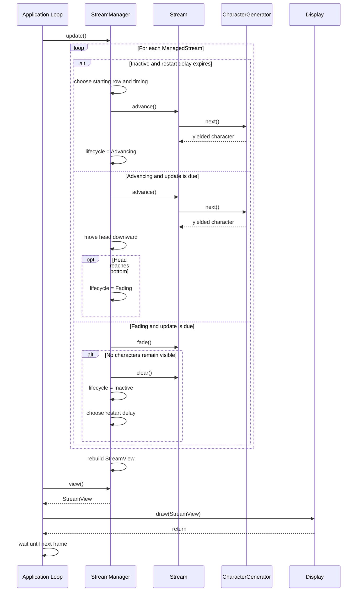
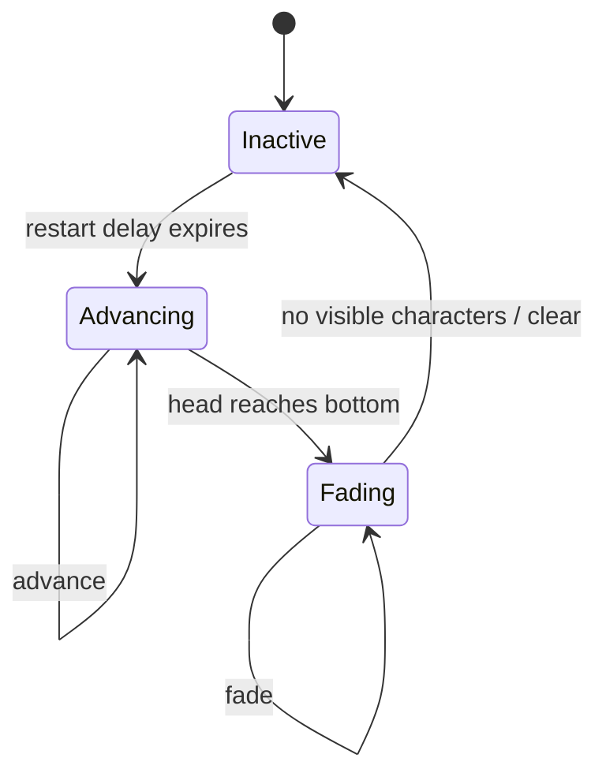

## Design Principle

The project follows one rule throughout the design process:

**Heavy design phase prior to implementation.**

The purpose of the design phase is to make the important architectural and engineering decisions before implementation begins. By the end of this document, coding should largely consist of translating an already-understood design into C++ rather than discovering the architecture while writing it.

---

# 1. Problem Statement

Create a terminal-based visualization inspired by the falling character streams from _The Matrix_.

The display consists of multiple independently evolving streams of characters. Each stream maintains persistent state and produces new characters over time.

As a stream advances downward, older characters remain visible behind its leading character and progressively fade until they are no longer visible.

Each display column contains at most one active stream. Once a stream reaches the bottom of the display, it stops producing new characters and its remaining characters fade away. After the stream is no longer visible, that column may later begin a new stream.

The visualization updates continuously at a controlled rate.

---

# 2. Subsystem Diagram

```text
[Display] <- visualization updates - [Stream Manager] - stream updates -> [Stream]
```

The `Stream Manager` coordinates the simulation. It controls the collection of streams and produces the state that should currently be displayed.

A `Stream` maintains the state of one independently evolving drop of characters.

The `Display` presents the visualization but does not control stream behavior.

---

# 3. Subsystem Responsibilities

|Subsystem Name|Instances|Functionality|Interfaces Exported|Interfaces Consumed|
|---|---|---|---|---|
|Display|1|Displays the current visualization|Update Visualization|None|
|Stream Manager|1|Coordinates multiple streams and their presentation|None|Update Visualization, Advance Stream, Read Stream State|
|Stream|Many|Maintains and evolves one character stream, including its characters and fading state|Advance Stream, Read Stream State|None|

An exported interface represents a capability that a subsystem makes available to other subsystems. A consumed interface represents a capability that a subsystem requires from another subsystem.

The Manager therefore consumes the Stream's ability to advance and expose its state. The Manager also consumes the Display's ability to present a visualization.

---

# 4. Execution and Threading Model

The application uses exactly **one thread**.

A central application loop exists outside the three subsystems. The `Display` does not own the execution loop because presentation should not be responsible for coordinating the rest of the application.

During each application frame, the loop allows the `StreamManager` to update the simulation, obtains the resulting display state, asks the `Display` to draw it, and then waits until the next frame.

Streams are logically independent but are not executing simultaneously. The Manager processes them sequentially on the single thread.

Different streams may nevertheless have different starting locations, progression speeds, fading speeds, and restart times. Their behavior therefore appears independent even though their execution is sequential.

---

# 5. Class Structure

The system requires no inheritance hierarchy.

Composition is sufficient.

```text
Application Loop
    |
    +-- StreamManager
    |      |
    |      +-- many ManagedStreams
    |               |
    |               +-- Stream
    |                      |
    |                      +-- StreamCharacters
    |                      +-- CharacterGenerator
    |
    +-- Display
```

The main system classes are `Stream`, `StreamManager`, and `Display`.

`StreamCharacter`, `CharacterGenerator`, `ManagedStream`, `StreamLifecycle`, and `StreamView` are supporting types.

The application loop itself does not need to be represented by a class.

---

# 6. Detailed Design

## `StreamCharacter`

`StreamCharacter` is a small value type representing one character in a stream.

It contains a character and an unsigned brightness value. Brightness ranges from `0` to `255`. A value of `255` represents a newly generated character at maximum brightness, while `0` means the character is no longer visible.

The type exposes its brightness, allows its brightness to be decreased, and reports whether it remains visible.

Brightness subtraction must saturate at zero. Unsigned arithmetic must never be allowed to wrap around.

Conceptually:

```text
if decrement >= brightness
    brightness = 0
else
    brightness -= decrement
```

`StreamCharacter` has no ownership responsibilities and requires no design pattern.

---

## `CharacterGenerator`

`CharacterGenerator` lazily produces random characters for a `Stream`.

This is the portion of the system implemented using a C++ coroutine.

The generator owns a `std::coroutine_handle` associated with its coroutine frame. The corresponding `promise_type` stores the character most recently produced by the coroutine.

The generator is lazy. Creating it does not immediately produce a character. Instead, execution begins or continues when the generator is asked for its next value.

The coroutine conceptually behaves as:

```text
create random-number state
        ↓
loop forever
        ↓
choose random character
        ↓
yield character
        ↓
suspend
        ↓
resume later at the same location
```

The random-number engine should be a local variable belonging to the coroutine. Because local coroutine state survives suspension, its random-number state persists naturally between generated characters.

The generator chooses uniformly from a fixed set of printable characters.

Its `promise_type` stores the currently yielded character. `yield_value()` records that character and suspends execution.

The coroutine initially suspends so generation is lazy.

The coroutine also suspends at final completion so that its frame remains valid until its owning wrapper destroys it. Although this particular generator is intended to run indefinitely, its lifetime should still be managed correctly.

The `CharacterGenerator` wrapper exclusively owns the coroutine handle. It is therefore moveable but not copyable. Destroying the wrapper destroys the coroutine frame.

Requesting the next character resumes the coroutine exactly once and retrieves the yielded character from the promise.

The generator does not store previously produced characters. Once a character has been yielded, the `Stream` is responsible for storing it.

The primary pattern here is the **Generator pattern**. Its use resembles an iterator, except values are produced lazily rather than read from an existing collection.

---

## `Stream`

A `Stream` represents one independently evolving drop of rain.

It owns the sequence of characters belonging to that drop. It does **not** know which column it occupies, what row its head currently occupies, or how large the terminal is.

The character sequence is stored in an `std::vector<StreamCharacter>`.

Characters are ordered from oldest to newest. The final element represents the current head of the stream.

Each `Stream` also owns one `CharacterGenerator`.

Each Stream is assigned one fade rate when it is initialized. To create visual variation, the fade decrement is selected from:

```text
32
16
8
```

With maximum brightness equal to `255`, these correspond approximately to:

```text
8 fade steps
16 fade steps
32 fade steps
```

A decrement always saturates at zero.

### Advancing

When `advance()` is performed, every existing character first fades by the Stream's fade amount.

The Stream then asks its `CharacterGenerator` for one new character, creates a new `StreamCharacter` at maximum brightness, and appends it to the sequence.

Exactly one new character is added by each call to `advance()`.

Conceptually:

```text
fade existing characters
        ↓
resume CharacterGenerator
        ↓
receive one character
        ↓
create StreamCharacter at brightness 255
        ↓
append to sequence
```

### Fading

`fade()` decreases the brightness of every existing character but does not produce a new character.

This allows a Stream that has reached the bottom of the terminal to continue disappearing without continuing to grow.

### Clearing

`clear()` removes all characters from the Stream and restores its character sequence to the empty condition.

The `CharacterGenerator` itself does not need to be destroyed when a Stream is cleared. It may continue its random sequence when that Stream is used again.

### Inspection

The Stream provides read-only access to characters by position. It can also report whether it contains any characters and whether any of its characters remain visible.

The exact decision between returning copies and const references can be made while expressing the API in C++, because it does not affect the architecture.

### Stream Invariants

The newest character is always the head.

`advance()` adds exactly one character.

`fade()` never adds a character.

Brightness never drops below zero and never wraps around.

The Stream never determines whether it has reached the bottom of the screen. That is the responsibility of the `StreamManager`.

The Stream therefore contains no row, column, terminal-size, or presentation information.

No additional design pattern is required inside `Stream`.

---

## `StreamLifecycle`

Each managed Stream is conceptually in one of three states:

```text
Inactive
Advancing
Fading
```

The lifecycle is a simple state machine:

```text
Inactive
    |
    v
Advancing
    |
    v
Fading
    |
    v
Inactive
```

An `Inactive` Stream is currently absent from the visualization.

An `Advancing` Stream is moving downward and producing new characters.

A `Fading` Stream has reached the bottom of the display. Its head no longer moves and it produces no new characters. Its existing characters continue fading.

Once none of those characters are visible, the Stream is cleared and returns to `Inactive`.

This requires only a small enum-like representation. A hierarchy of State classes would add unnecessary complexity.

---

## `ManagedStream`

`ManagedStream` is an internal value type used by the `StreamManager`.

It groups a `Stream` with the information required to position and control that Stream.

It contains the Stream, its current head row, its current `StreamLifecycle`, and the small amount of timing information required to determine when it should next change.

The column does not need to be stored explicitly. The position of a `ManagedStream` inside the Manager's collection determines which display column it owns.

For example:

```text
managed_streams[0] -> column 0
managed_streams[1] -> column 1
managed_streams[2] -> column 2
...
```

To create independent-looking movement while remaining single threaded, a managed Stream may use an update interval measured in application frames.

For example, one drop may update every frame while another updates every two or three frames.

When an inactive Stream finishes fading, the Manager may also assign a randomized restart delay before activating it again.

These small counters are simulation state, not additional threads or timers.

`ManagedStream` does not require its own behavior-heavy class. A small struct is sufficient.

---

## `StreamView`

`StreamView` represents the complete visualization at one instant.

It is a two-dimensional matrix arranged as:

```text
rows × columns
```

Each cell contains either no character or one `StreamCharacter`.

A suitable representation is conceptually:

```text
std::vector<
    std::vector<
        std::optional<StreamCharacter>
    >
>
```

`StreamView` may be a named type alias rather than a class.

The important design rule is that `StreamView` contains **derived presentation state**.

It is not the authoritative source for Stream positions.

The relationship is:

```text
Streams + positions
        |
        v
    StreamView
        |
        v
      Display
```

The Manager must never scan the `StreamView` to rediscover where a Stream is located. It already owns that position information.

---

## `StreamManager`

`StreamManager` coordinates the simulation.

It owns the display dimensions, one `ManagedStream` for every column, and the current `StreamView`.

Its collection of managed Streams is stored in an `std::vector<ManagedStream>`.

Exactly one managed Stream exists per column.

At most one active drop may occupy a column at a time.

### Updating Streams

During an update cycle, the Manager visits every `ManagedStream`.

If a Stream is `Inactive`, its restart timer is updated. When that timer permits activation, the Manager chooses a starting head row, establishes its progression timing, changes the state to `Advancing`, and advances the Stream once to create its first visible character.

If a Stream is `Advancing`, the Manager determines whether that Stream should progress during the current application frame. If so, it calls `advance()` and moves the head downward by one row.

When the head reaches the final display row, the lifecycle changes from `Advancing` to `Fading`.

If a Stream is `Fading`, the Manager periodically calls `fade()` without moving the head.

When the Stream reports that no characters remain visible, the Manager calls `clear()`, changes its lifecycle to `Inactive`, and chooses a future restart delay.

Conceptually:

```text
Inactive
    |
    | restart delay expires
    v
Advancing
    |
    | head reaches bottom
    v
Fading
    |
    | no characters visible
    v
clear
    |
    v
Inactive
```

### Building the View

After logical Stream updates are complete, the Manager rebuilds the `StreamView`.

The view is cleared before projection so it represents only the current simulation state.

For a Stream whose newest character is currently located at:

```text
row = R
column = C
```

the newest character appears at:

```text
[R][C]
```

The previous character appears at:

```text
[R - 1][C]
```

and progressively older characters continue upward.

Characters whose calculated row is above the top of the display are ignored.

Characters with brightness `0` are also ignored.

Because only one Stream exists per column, the Manager never needs to resolve collisions between separate drops.

### Manager Invariants

Exactly one `ManagedStream` exists for each display column.

The Manager is the authoritative owner of Stream position.

A Stream's head never advances beyond the final row.

After reaching the final row, that Stream only fades.

An invisible Stream eventually becomes inactive.

The `StreamView` is always derived from current simulation state.

The primary algorithmic pattern inside the Manager is the **State Machine** used for Stream lifecycle management.

No Observer pattern, inheritance hierarchy, or asynchronous worker system is required.

---

## `Display`

`Display` contains terminal-presentation logic.

It does not own the `StreamView`. The view exists long enough for the Manager to provide it to `Display::draw()`.

The Display traverses the matrix row by row.

An empty cell is presented as blank space. A visible `StreamCharacter` is presented using its character and brightness.

Brightness is converted into terminal color intensity. Since brightness uses the range `0–255`, it can naturally control the green component of an ANSI true-color terminal sequence.

Conceptually:

```text
brightness 255 -> very bright green
brightness 128 -> medium green
brightness 32  -> very dark green
brightness 0   -> not rendered
```

The Display controls **how** brightness is represented visually.

It does not decide when Streams move, how Streams fade, where Streams begin, or which characters are generated.

The Display also handles the terminal operations necessary to redraw subsequent frames without producing a permanently growing wall of output.

No design pattern is required.

---

# 7. Application Loop

The application loop remains outside all system classes.

Conceptually:

```text
create StreamManager
create Display

while application is running

    StreamManager updates simulation

    obtain StreamView

    Display draws StreamView

    wait approximately 50 ms
```

This loop is the only active execution context.

All operations therefore occur on the same thread.

The coroutine-based `CharacterGenerator` does not create another thread. When resumed, it runs on the application thread until it yields another character and suspends again.

---

# 8. UML Sequence Diagram

The following diagram represents one ordinary application frame.



The important feature of this sequence is that control consistently flows downward from the application loop.

Streams do not notify the Manager when something changes. The Manager already owns the control flow and asks each Stream to perform the appropriate operation.

The coroutine also does not execute independently. `CharacterGenerator::next()` resumes it synchronously on the current thread. It runs until the next yield and then returns control to the Stream.

---

# 9. Stream Lifecycle Diagram

Although the primary UML artifact is the sequence diagram, the Stream lifecycle is easier to understand separately as a state machine.



This state machine is conceptual. It does not imply use of the Gang-of-Four State pattern.

---

# 10. Error Handling

Error handling for Project 1 is intentionally simple. The program is a local visualization with no network communication, persistent storage, or external services, so elaborate recovery mechanisms would add little educational value.

Construction-time configuration errors should fail immediately. Invalid display dimensions, impossible configuration values, or other invalid initialization arguments should be rejected before the main loop begins.

Memory-allocation failures from vectors or coroutine-frame allocation are not recoverable within the scope of this project and may propagate normally.

The coroutine generator owns its coroutine frame through RAII. Destroying the `CharacterGenerator` must destroy the associated coroutine handle exactly once. Copying the generator is forbidden so two objects can never believe they own the same frame.

Because the character generator contains no operation that is expected to fail during normal use, an unexpected exception escaping the generator coroutine is treated as fatal for Project 1. The coroutine's `unhandled_exception()` may therefore terminate the program rather than introducing a larger exception-transport mechanism.

Out-of-range Stream or View access represents a programming error rather than a normal runtime condition. The Manager's algorithms should maintain valid indices by construction. Assertions may be used while developing to verify these invariants.

Terminal-output failure is also treated as fatal. If the output stream enters a failed state, the application may stop rather than attempting terminal recovery.

Before normal program exit, terminal presentation state should be restored if the Display altered cursor visibility, colors, or other terminal settings.

---

# 11. Ownership Summary

Ownership is deliberately simple.

```text
Application
    |
    +-- StreamManager
    |      |
    |      +-- vector<ManagedStream>
    |      |       |
    |      |       +-- Stream
    |      |              |
    |      |              +-- vector<StreamCharacter>
    |      |              |
    |      |              +-- CharacterGenerator
    |      |                       |
    |      |                       +-- coroutine frame
    |      |
    |      +-- StreamView
    |
    +-- Display
```

No `shared_ptr` is required.

The `StreamManager` owns the simulation.

Each `Stream` owns its characters and its generator.

Each `CharacterGenerator` exclusively owns one coroutine frame.

The `Display` temporarily reads the view but does not own it.

---

# 12. Algorithms and Patterns Summary

The application uses four important algorithms or patterns.

The **Generator pattern** provides lazy random-character generation. The generator's execution state and random-number state survive suspension naturally inside the coroutine frame.

A simple **State Machine** controls the lifecycle of every Stream through `Inactive`, `Advancing`, and `Fading`.

The Manager uses a straightforward **projection algorithm** to transform Streams plus their head positions into a two-dimensional `StreamView`.

The Display uses a **rendering traversal** that converts the view's characters and brightness values into terminal output.

No inheritance hierarchy, Observer pattern, thread pool, scheduler, shared-ownership graph, or elaborate framework is required.

---

# 13. Implementation Order

Implementation should follow the dependency structure established by the design rather than rediscovering the architecture while coding.

A sensible order is:

```text
StreamCharacter
        ↓
CharacterGenerator
        ↓
Stream
        ↓
StreamLifecycle / ManagedStream / StreamView
        ↓
StreamManager
        ↓
Display
        ↓
Application Loop
```

Each piece should be tested or exercised before relying on it in the next layer.

Once implementation begins, architectural questions such as ownership, Stream lifetime, position tracking, control-flow direction, fading behavior, and subsystem responsibilities should already be considered settled.

The remaining work should primarily consist of expressing this design cleanly in C++.
